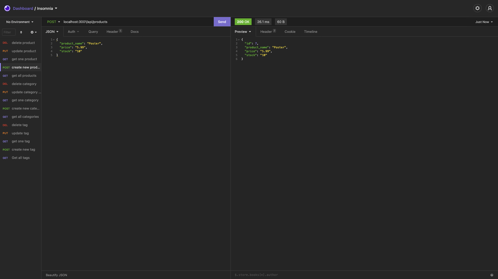
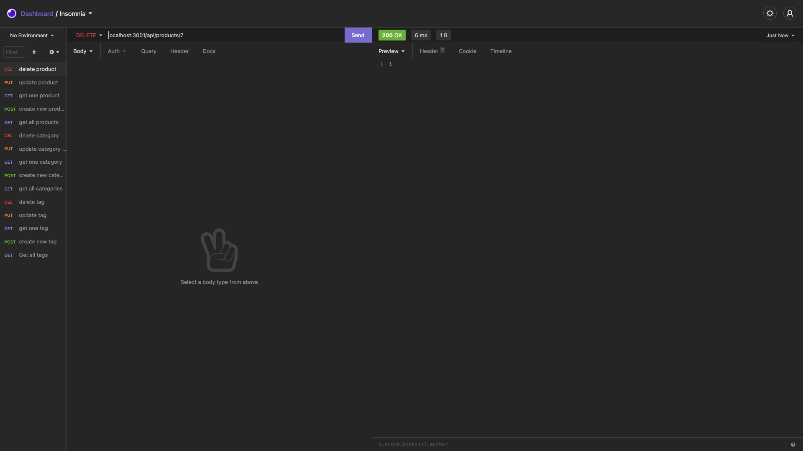
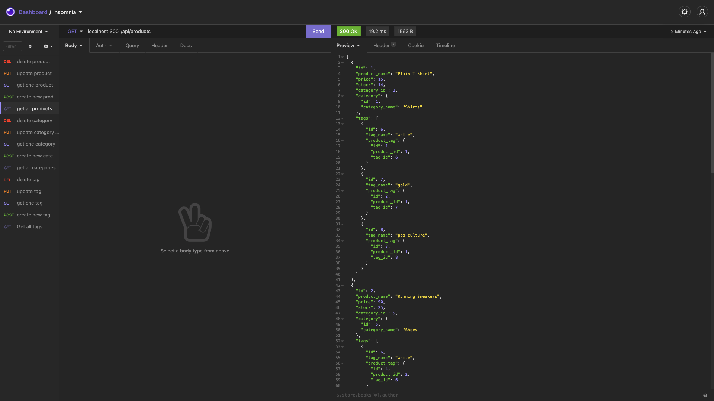
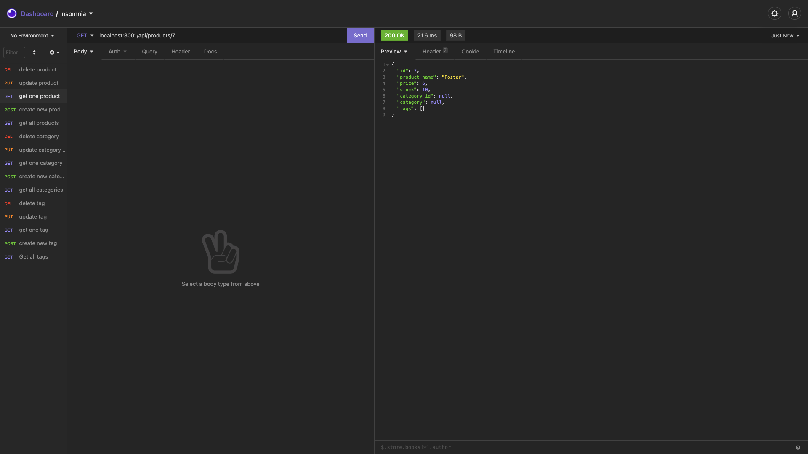
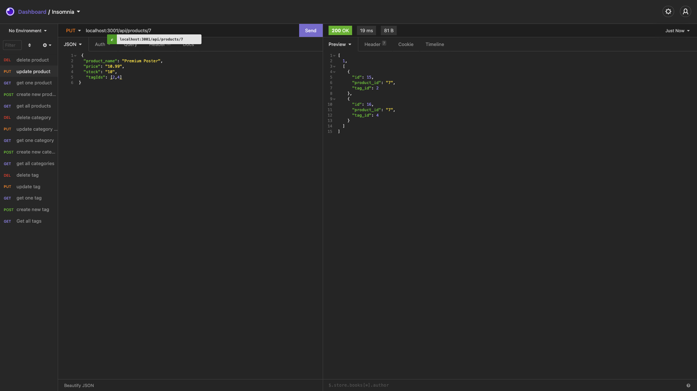

# E-Commerce-Back-End

## Description:
- This application was built to help organize, keep track of and categorize products for an e-commerce website. It makes entering, editing, updating and creating products, categories and tags more efficient. The user can also view all the data so that they can easily see what is needed to restock or how much of an item is in stock. 

## Table of Contents:
- [Usage](#usage)
- [Visual Sample](#visual)
- [Contributors](#contributors)
- [Github](#github)
- [Email](#email)

## Usage:
- Start MYSQL Shell. Then run node seeds/index.js to seed the data. Finally node server.js to start the application
- Or watch the walkthrough video here:
https://drive.google.com/file/d/1fpiOHeHANdRoOIHDHKQksQFH6DBjOkM0/view

## Visual Sample:

## Contributors:
- Karen Pion

## Contact:
- Github: ksapir
- Email: karenlpion@gmail.com
